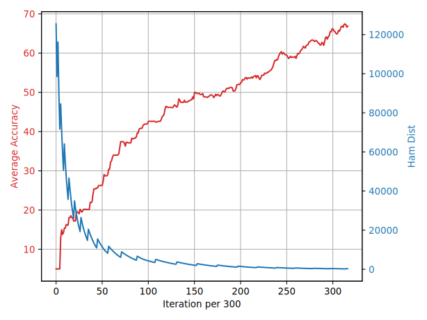
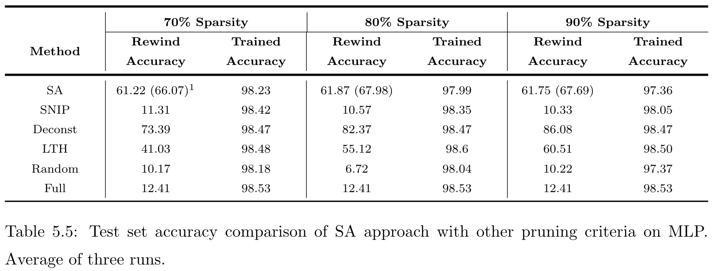
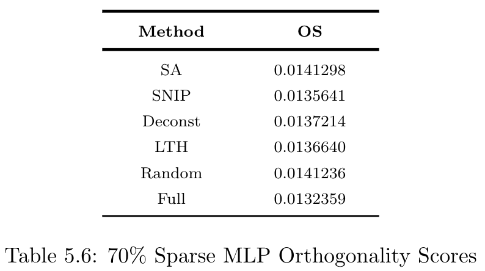
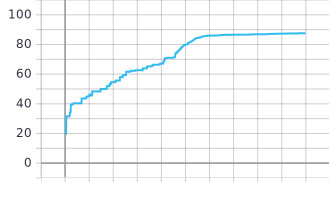
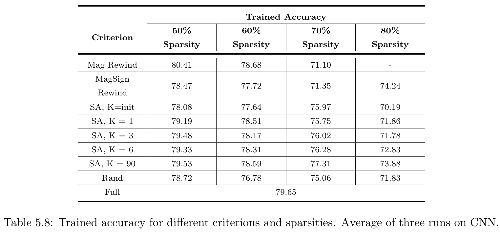

# EEE 198: Heuristic Approach Towards Early Pruning Of Neural Networks

## Authors

This codebase was developed by Jeff Sanchez and Marcus Reyes for during
their senior-year project; UCL, UP-Diliman 2020.


## Background

This library is the implementation of our thesis project, titled
<em>"Heuristic Approach Towards Early Pruning Of Neural Networks."</em> Taking
inspiration from recent works on lottery tickets
[1,2], Model Compression [3], and Early Pruning [4], we wanted to automate
the process of finding high performing and high sparsity subnetworks (winning
tickets), without relying on already trained networks. This form of compression
allows for memory and energy savings in training neural networks. After our
initial attempt of using an [RL agent](https://www.github.com/prokorpio/everything_190) to
search for these subnetworks, we resolved to using a simpler approach based on
the heuristic search algorithm, Simulated Annealing (SA).

SA works by iteratively trying out various masks and selects the one that
yields the best estimated performance. That is, given a network with full
parameters, the algorithm will heuristically traverse a search space of masks
(which represents parameters to be pruned or kept), on each step accepting a
new candidate mask if it improves performance, otherwise, will accept it
with probability based on how bad it degrades performance and a global
temperature variable that makes it less and less likely to accept bad masks
towards the end of the process.

To evaluate the performance of SA, we run the following experiments:

1. <b>SA on CNN</b>
    1. Mask Search on CNN    
        1. Randomly initialize the neural network (initialization w<sub>init</sub>)
        2. Train for K epochs (K within [0,90])
        3. Run SA search
        4. Save best mask found
    2. Actual Pruning CNN
        1. Load SA-found mask
        2. Load masks generated using other criterion
        3. Apply different masks on multiple network intances (with similar
           initializations w<sub>init</sub>)
        4. Prune: delete filters based on masks
        5. Save pruned network
    3. Training Pruned CNN
        1. Load pruned networks
        2. Train networks for 90 epochs on CIFAR-10
        3. Save performance logs

2. <b>SA on MLP</b>  
    Since only preliminary experiments and analysis were done on MLP, we only
    implemented SA search and masked-pruning (no actual deletion of parameters).
    Similar steps are followed as above, but without actual pruning.

3. <b>Additional Analysis</b>
    1. Orthogonality scores and training loss plots on MLP. To shed light on the
       disconnect between high untrained performance yet subpar final (trained)
       performance.
    2. Mask similarity matrices on MLP and CNN. To examine relationships between
       masks generated by SA and those by other criterion.
    3. Testing the effect of using larger validation set for SA mask performance
       estimation.


## Summary of Results

### MLP Experiments
1. <b>Sample plot of SA search</b>  
    <p align="center">
    
    </p>
    The plot above shows in red the estimated performance of masks tried by SA
    throughout its search process. This specific run prunes 90% of the weights,
    and the estimated performance is taken at initialization (k=0). Shown in
    blue is the relative hamming distance of masks tested, experimentally
    tuned, and serves to increasingly limit the neighborhood of the search
    space.  

2. <b>Criterion Comparison</b>
    <p align="center">
    <br/>
    </p>

    We observe three things from the table above: (1) Across sparsities, SA and
    Random are consistently the bottom two compared to the rest of the other
    criteria. (2) The achieved optimized accuracy of SA on the validation set
    is still lower than that of Deconst<sup id="a1">[1](#f1)</sup>. (3) SA has
    significant discrepancy between validation accuracy (maximized accuracy on a
    validation set used in SA search) and rewind accuracy (test accuracy of the
    final SA mask applied at initialization). The following empirical analyses
    shed more light in these observations.  

3. <b>Trainability</b>  
    <p align="center">
    
    </p>

    By the virtue of having high orthogonality scores<sup id="a2">[2](#f2)</sup>
    and slow-moving training loss plots, we concluded that both SA and Random
    criterion  exhibit  a  more  hampered  training  as  compared  to  other  
    criteria  which  results in the two attaining sub par final performances.
    Additionally, although we resolved not to extend the OS formula for
    convolutional layers, the training loss plots for CNN showed similar
    trends. Specifically, Mag criterion more rapidly slows down as compared to SA
    and Rand, however its rapid downward slope decreases as sparsity is
    increased.  

4. <b>Mask similarities</b>  
    By looking at the cosine similarities among different masks obtained by SA,
    derived from other criterions, and random masks (all represented as vectors
    and compared in groups, accordingly), we concluded that it is only when the
    objective function used in SA (accuracy of masked network) is based on
    partially trained accuracy that this objective function is better able to
    guide the search process towards better regions in the search space. In
    other words, the SA search effectiveness is limited by the information
    available from the objective function. CNN data agrees with this observation.  

5. <b>Discrepancy on validation and test accuracies</b>  
    Similar to other low-fidelity performance estimation [6], the
    use of a small subset of training data to estimate the mask performance
    proved to cause overfitting on this small validation set. This is
    empirically proven in CNN experiments.   

### CNN Experiments
1. <b>Sample plot of SA search</b>  
    <p align="center">
    
    </p>

    Similar as the plot for CNN; this one shows SA on CNN, selecting
    only 50% of filters, at k=90.

2. <b>Criterion Comparison</b>  
    <p align="center">
    
    </p>

    The  data  here  indicates  three  things:   (1) By  itself  SA  performs  
    relatively  well with only around 2% and 6% accuracy drop at 70% and 80%
    filter sparsity.(2) At the extreme sparsities SA outperforms Mag Rewind
    and performs on par or better than Mag Sign Rewind<sup id="a3">[3](#f3)</sup>;
    (3) Increasing the epoch k wherein the SA algorithm is applied causes a
    corresponding consistent increase in the converged accuracy of SA.

3. <b>Mask Similarities</b>  
    Similar to the MLP findings, we find that increasing partial-training k
    results to the search exploring more focused regions in the search space
    which itself are closer to where other good masks are (masks from
    different criterions).

4. <b>Discrepancy on validation and test accuracies</b>  
    To test if the validation set limits the performance of the SA search, we
    experimented on using larger validation set sizes and found that indeed
    this method of low-fidelity estimation results to a strong bias towards the
    small validation data.


## Getting Started

1. Install library dependencies.

    * `torch 1.5.0`
    * `torchvision 0.6.0`
    * `tensorboard 2.1.0`
    * `numpy 1.17.4`
    * `pandas 1.0.1`


2. For MLP experiments, run:
```bash
souce experiment_script.sh
```

This will execute 3 instances of `main_SA_MLP.py`, one for each sparsity 70\%, 80\%,
and \%90 (for all criterions SA, SNIP[4], Deconst[2], LTH[1], and random pruning).
Results log, SA optimization plot, and tar files will be saved in
`sparsity_#/trial_1/`. We recommend to start with MLP experiments as it is
more straightforward.

3. For CNN experiments, run:
```bash
python main_script.py
```

This will execute 4 runs of [CNN masking -> `actual_prune.py` ->
`train_actual_subnet.py`], one for each sparsity 50\%, 60\%, 70\%, and 80\% (for
all criterions SA, SA_k, Magnitude (structured-LTH)[1], MagSign
(structured-Deconst)[2]). `.pth` files will be stored in folders: `masked_may_exp/`,
`pruned_may_exp/`, and `trained_may_exp/`, and results log in `textlogs/`.

## Code Files

### Main components
1. `MLP_experiments/`
    1. [main_SA_MLP.py](MLP_experiments/main_SA_MLP.py) MLP masking for SA, SNIP, Deconst, and LTH
    2. [utilities_MLP.py](MLP_experiments/utilities_MLP.py) for masking, SA, and top-level NN functions
    3. [networks_MLP.py](MLP_experiments/networks_MLP.py) models used for MLP experiments
2. For CNN masking:
    1. [main_SA.py](main_SA.py)
    2. [main_pruner_mag_rewind.py](main_pruner_mag_rewind.py)
    3. [main_pruner_mag_sign_rewind.py](main_pruner_mag_sign_rewind.py)
    4. [main_pruner_random.py](main_pruner_random.py)
3. [actual_prune.py](actual_prune.py)
4. [train_actual_subnet.py](train_actual_subnet.py) and [trainer.py](trainer.py) for training subnets and original full CNN, respectively
5. Tools:
    1. [environment.py](environment.py) model masking and top-level NN functions,
       re-used from [work on RL](https://www.github.com/prokorpio/everything_190)
    2. [utilities.py](utilities.py) SA loop functions, and PrunedSubnet class
    3. [initializer.py](initializer.py) generates init.pth files for uniform weight inits
       across experiments
    4. [models_to_prune.py](models_to_prune.py)

### Analysis Scripts
1. `MLP_experiments/`
    1. [orthogonality_score.py](MLP_experiments/orthogonality_score.py) computes OS, as per [5], of all MLP masks
    2. [plot_mask_trainability.py](MLP_experiments/plot_mask_trainability.py) runs tensorboard for observing
       trainability in training loss plots
    3. [orthogonality_repair.py](MLP_experiments/orthogonality_repair.py) explored weight orthogonality repair, as per
       [5]. Not included in paper.
2. [main_var_script.py](main_var_script.py) and [main_var_SA.py](main_var_SA.py) for SA similarity matrix
   experiments, saves files in paths different from that in `main_SA.py`
3. [mask_similarities.py](mask_similarities.py) compute similarity matrix (works for both CNN and
   MLP)


## Datasets
1. [CIFAR-10](https://www.cs.toronto.edu/~kriz/cifar.html) for CNN experiments.
2. [MNIST](http://yann.lecun.com/exdb/mnist/) for MLP experiments.

## Footnotes
<sup id="f1">1</sup> mask generated using Magnitude-Sign (MagSign), criterion as
defined in Deconstructing Lottery Ticket by Zhou et al [2]. [↩](#a1)  
<sup id="f2">2</sup> higher OS means less propagation of learning signals [5][↩](#a2)  
<sup id="f3">3</sup> extreme filter sparsity of 80%, Mag Rewind consistently prunes
an entire layer and thus has no output.[↩](#a3)   


## References
[1] [Lottery Ticket Hypothesis](https://github.com/google-research/lottery-ticket-hypothesis)  
[2] [Deconstructing Lottery Ticket](https://github.com/uber-research/deconstructing-lottery-tickets)  
[3] [AutoML for Model Compression](https://github.com/mit-han-lab/amc-models)  
[4] [SNIP](https://github.com/namhoonlee/snip-public)  
[5] [SNIP-2](https://arxiv.org/abs/1906.06307)  
[6] [NAS Survey](https://arxiv.org/abs/1808.05377)
